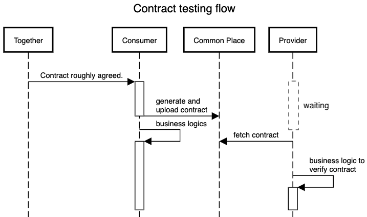
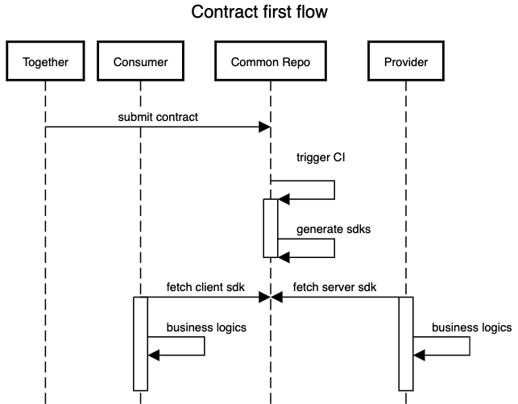

# Do You Really Need Contract Testing? Contract-first Development with Generated Code Is Probably A Better Choice.

## Problems of Contract

With the advantages of less coupling, improved scalability, easier deployments, to name but a few, microservice pattern is widely adopted. The communication previously performed within memory of the monolith is now in the formats of http requests and message queues along with others. Such communication requires agreements among different ends, typically between service consumers and providers, including message format, authentication mechanism, etc. These agreements are documented as contracts.

Along with the evolution of the product, contracts could vary frequently, and the endpoints in the development environment can be incompatible to each other or even down for maintenance, which is creating dependencies and blockers among teams. Additionally, it's pretty common that different teams have different pace of development, different priorities, so that the problem of contract maintenance with different versions is becoming ubiquitous. A production-safe way of collaboration that can reduce dependencies between service consumers and providers, to keep them independently moving forward, is fairly essential.

## Contract Testing

[Contract Testing](https://docs.pact.io/#what-is-contract-testing) (contract testing) is born to solve this problem. Here is the definition of contract testing referenced from *Pact* Website：

> Contract testing is a technique for testing an integration point by checking each application in isolation to ensure the messages it sends or receives conform to a shared understanding that is documented in a "contract".

In order to test the integration with an external service, we don't actually call the target service because it may break our tests when it's down or updated with newer versions. Instead, we create a test double, which can return the stubbed results of the real one, to keep the contract and make the development isolated enough, so as to improve development efficiency. Contract testing is mostly designed to facilitate consumer-driven development, which is very popular due to its reducing the unnecessary implementations on the service provider, so consumer-driven contract test is more and more adopted in engineering teams.

The adoption of contract testing does help a lot of teams to improve their efficiency, while some other teams don't feel it is worth the effort. For sure the benefits don't come for free. Every new endpoint, new field of payload, every change of the nullability of an existing field, or extension of an enum, can bring changes to test cases. After the contract testing, the new contract is finally generated, mostly in the format of openapi specification, as the source of truth for future discussions or references.

## Collaboration Flow for Consumer-driven Contract Testing

1. The service consumer and provider sit together to agree on a base contract. A new endpoint should be created, request body is `RequestDto`, and response body is `ResponseDto`, and `a` field and `b` field is not nullable.
2. Service consumer writes contract tests according to the agreement, and generates a contract after the contract tests pass, and then upload the contract to a shared place. After that, they can focus on their own business logic.
3. Service provider download the contract, and follow the test driven development, to implement their business logic and verify the contract.

## The Problem of Contract Testing

While your team is really writing contract tests, people tend to feel that there are a lot of straightforward contracts, such as nullability, string format, they are easy to note in the doc and super easy to implement, but require trivial contract tests.

More importantly, our generated contract could be more concise than expected, for example we don't necessarily write every 400 or 401 test cases for every single endpoint, but they are truly worth being documented, or they can be more detailed than expected due to more edge cases being recognized. Every time we need to modify the contract, we need to discuss again, then write consumer-side contract tests again, and the provider is blocked again waiting for the contract to be generated. And this results in inefficiency.

## Keys to Solve the Problem

The long feedback loop problem is everywhere. We do iterations and periodical showcases to get earlier feedback. We do continuous integration to earlier recognize the compatibility between the new feature and the existing. We do pair coding to move the discussion from the pull requests to the start of the coding. Similarly, it would be beneficial if we can shorten the distance of the discussion, documentation, and implementation, and reduce the time of waiting. On the one hand, consolidate the contract as early as possible, so that the details and edge cases are exposed and addressed early. On the other hand, instead of waiting for the trivial consumer-side contract tests, use generated code to restrict the consumer and the provider to follow the contract, and meanwhile they are unblocked once the code is generated.

## Contract-First Development with Generated Code

It's called contract-first development, because the contract is written before any code in the lifecycle of a feature. The contract can be hand-written, or generated by some GUI tools, it just needs to be straightforward enough. The contract, as an openapi specification file, is maintained in a shared repository, where pipelines are triggered on commits to automatically generate SDKs for the communication. 

Our example is using [openapi generator](https://github.com/OpenAPITools/openapi-generator) for spring boot services.

For the consumer side, a restTemplate with proper logics and models including DTOs and validation annotations, can be generated according to the contract, and be encapsulated within a client, exposing one method which will be handling all the calls to the provider endpoint. Ideally with this method, the consumer can only call the endpoint with agreed ways, i.e. the consumer will only send valid requests. The real case will depend on how delicate the code generation is set up, similar to how trivial the contract tests are written. In this way, the service consumer just needs to focus on what information should be passed rather than how they are passed.

For the provider side, the `@Controller`s, `RequestDto`s, and `ResponseDto`s can be generated to handle the corresponding endpoint properly. All the simple validations such as `@NotNull`, `@Pattern`, `@Size` can be generated accordingly, and be validated by spring, so that our service provider can reject invalid requests automatically. The provider team just needs to override the generated method to implement their feature.

In this way, both the consumer and the provider are unblocked immediately when the pipeline passes.

## Collaboration Flow for Contract-First Development

1. Service consumer and provider sit together to agree on a contract and submit it in the repository, and the pipeline is triggered and the SDKs are generated.
2. Both the consumer and the provider teams import the SDK and start implementation

Compared to the flow of contract testing, the contract is earlier consolidated with fine-grained specifications, so that necessary communications are shifted to the left, so that the feedback loop is shortened. Furthermore, once the contract is submitted, the SDKs are generated shortly to unblock dev teams. The wait time is removed so that both teams can start in parallel.

## When to Use Contract-First Development with Generated Code

Contract-First Development is not a silver bullet. It's more efficient in specific cases.

**When the contract is straightforward enough.** Some nullability check, format, simple mapping among fields, etc. These are good reasons to use generated code and start with detailed contract consolidation. However, if your contracts include a lot of business specifications that are difficult to describe in openapi docs, writing separate contract tests tells a better story, and it leads to better maintainability.

**Our language/framework gets well supported by openapi generator.** If we need to pay too much effort generating code, or we need too much customization, then this method is not efficient.

**We already have comprehensive integration tests.** Although the aforementioned generated code can be utilized automatically by our framework, it cannot prevent us from more production incidents if we don't expose our error cases earlier than release. Those error cases resulting in production errors sometimes cannot be exposed through unit tests. For example, a generated `@NotNull` in a `RequestDto` will work when spring is started, which means the corresponding cases should be covered by integration tests.

## Costs

There is no such thing as a free lunch. With the benefits, contract-first development comes with costs.

The main one should be the learning overheads of the openapi generator. For now openapi generator supports most of the languages and frameworks, but in order to make it fit for our needs, some customization will be needed, which requires effort.

## Conclusion

Contract maintenance is crucial for cross-team development under the microservice pattern. Contract testing is a good way to keep the contract and decouple different teams. For some cases, contract-first development with generated code is more efficient thanks to its shortening feedback loops and removing trivial contract tests, typically when the contract is straightforward enough, our tech stacks suits openapi generator or any similar generator, and there are already comprehensive integration tests. To use it we need to make tradeoffs between its benefits and its overheads such as learning efforts. Try it and improve your team velocity!
