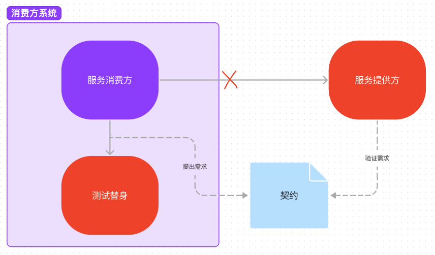
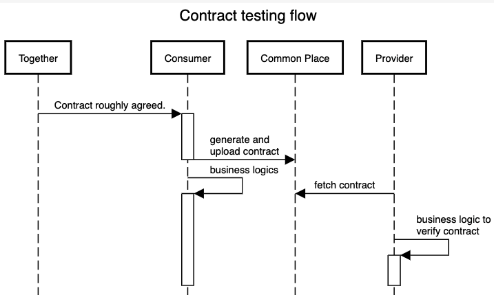
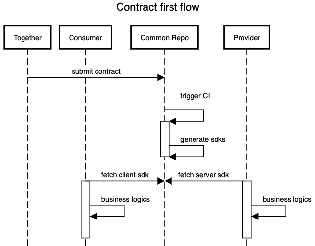

# 契约先行开发

## 契约维护问题

如今微服务凭借其灵活、易开发、易扩展等优势深入人心，不同服务之间的集成和交互日渐繁多且复杂。这些服务之间交互的方式是多样的，常见的有 HTTP 请求和消息队列，在它们交互的过程中，会有服务的版本演进，交互信息的格式或方式就会产生变化，前后版本的接口可能并不兼容，然而不同服务的开发进度有快有慢，各团队的优先级有高有低，服务间交互方式的匹配性就成了一个问题。这里，不同团队之间，对服务间如何进行发送和接受消息所能达成的共同理解，我们称之为契约 (contract)。如何采用一个合理的机制，维护服务间契约，使服务提供方和消费房能够在不造成事故的前提下，保持各自的高效开发，越来越成为各团队日常开发中要面对的问题。

## 契约测试

[契约测试](https://docs.pact.io/#what-is-contract-testing) (contract testing) 就是在这样的背景下应运而生，以下引用 pact 官网的定义：

> Contract testing is a technique for testing an integration point by checking each application in isolation to ensure the messages it sends or receives conform to a shared understanding that is documented in a "contract".

*契约测试是一种测试集成点的技术，它通过隔离检查每个应用程序，以确保其发送或接收的消息，符合记录在“契约”中的共同理解。*

也就是说，在测试己方服务时，通过使用测试替身 (test double)，让它能够模仿我们所依赖的外界系统，返回相对真实的消息响应，从而让我方团队在尽可能保证与外界系统兼容的前提下，避免受到外界系统宕机或开发新版本等影响，提升开发效率。再结合消费者驱动开发的优势，可以避免服务提供端浪费精力去实现不必要的功能，因此，很多团队采用了消费者驱动的契约测试 (consumer-driven contract test) 的实践。

在契约测试的帮助下，很多团队真正提升了开发效率，掌握了自己的节奏，但也有些团队发现效果并不明显，因为契约测试带来的收益并不是免费的。契约测试有着不少的开发成本，每有一个新的需求，新的接口，新的字段，或是老字段的可空性发生了改变，以及枚举值的增加或减少，都需要增加或减少一些测试用例，然后在测试的过程中生成新的契约。这些契约大多以 openAPI 文档的形式存在，作为两个团队日后讨论的基准。

## 契约测试驱动的合作流程

1. 消费方与提供方沟通，达成基本契约：增加一个接口，调用的时候传一个 RequestDto，接口返回一个 ResponseDto，其中 RequestDto 和 ResponseDto 哪几个字段要非空。
2. 消费方回去写自己的契约测试，生成契约 (通常以 openapi doc 形式)，然后以契约测试驱动，开发自己的逻辑
3. 服务方拿到生成的契约，进行测试驱动开发，验证契约是否被满足

## 契约测试的问题

上述流程有个明显的问题，契约需要在契约测试编写后生成。比如，第二步中生成的契约可能比当时商讨的更为简单，比如一些 400, 401 等情况，有时并不会为每一个 api 写足够细节足够详尽的测试；也可能生成的契约比商讨的更为详细，比如消费方在编写契约测试的过程中考虑到了更多的边缘场景。因而每当由以上情况导致修改契约时，我们都会重新沟通，再等待消费方重新写契约测试，再生成契约，然后服务方再开发。这个从沟通到落地的闭环比较长，每次修改时，服务方需要等待消费方编写测试，生成契约，然后消费方等待服务方按照契约开发完成，才能发布新的版本，这些等待都会拉低开发效率。

## 解决的思路

反馈周期长是我们经常需要面对的问题，比如我们要搞快速迭代，定期 showcase，就是为了及时得到客户的反馈；再比如我们搞结对编程，也是为了将 pull request 上可能出现的沟通提前，避免盲目开始之后又造成返工。这个时候我们再看开发流程时就会想，如果第一步的沟通可以直接产出固化的契约，足够直观和详尽，让双方及早沟通，同时又可以约束消费方和服务方双方，让沟通过后双方都可以直接开始开发就好了。基于这种目的，我们最近项目上采用了契约先行开发，初步达到了这种效果。

## 契约先行开发

这里说的契约先行，指的是在写所有代码之前，把我们沟通好的契约手写出来，或者通过一些图形化工具生成出来，比如手写或生成一个 openapi yaml 文档，这样沟通的产出足够直观。把这个文档放在代码库中维护，然后以它为依据，通过自动化流水线生成各方的沟通组件(sdk)，以 java + spring 为例，消费方可以生成封装好的 restTemplate 和 RequestDto/ResponseDto，服务方可以生成对应的 Controller 和 RequestDto/ResponseDto，并根据 openapi 文档中声明的非空字段、格式、长度等限制，自动添加注解，利用 spring 机制自动校验，省时省力省心。我们用到的工具是 [openapi generator](https://github.com/OpenAPITools/openapi-generator)，它可以根据 openapi 文档生成多种语言的 client 端代码、server 端代码、server stubs 代码等作为 library，服务双方直接引入 library 就可以进行通信，各自关注业务逻辑即可。

## 契约先行模式下，团队的沟通闭环

这样以来，团队的合作流程如下：

1. 消费方与提供方沟通，达成契约，并在契约代码库中一起提交契约代码，即 openapi doc。然后触发流水线，生成各方代码 sdk。
2. 双方各自引入 sdk 进入开发
    * 消费方引入 client 端 sdk，如封装了 restTemplate 的方法，消费方开发人员只需要关注己方业务需要，将合适的参数传给该方法，无需关注这些参数是用于 path 还是用于 body，该方法会以合适的方式与服务方沟通。同时我们可以定制化生成的方法，对非空字段进行校验，达到约束效果。
    * 服务方引入 server 端 sdk，如生成的 Controller 组件，http path 和方法的匹配等，服务方只需要复写相应的方法来完成自己的业务需求，无需关心传进来的参数是属于 path、header 或者是 body。由于定制化生成的 server 端 sdk 严格根据契约生成了合适的注解，比如 @NotNull, @Size, @Pattern 等，spring 可以自动对注解进行校验，server 端就可以自动拒绝不符合契约的请求。同时，由于生成的 ResponseDto 也带有响应 validation 注解，我们也可以对服务端返回的 Response 进行约束。

通过观察以上流程可以发现，与契约测试相比，该流程提前对沟通结果进行了直观的固化，使双方基于细节的沟通提前，从而将反馈周期缩短，减少返工概率。另外，契约一旦提交，自动生成的 server 端和 client 端 sdk 也同时可用，消除了开发过程中消费方和服务方之间的依赖，两端可以并行开发，减少等待时间，提升开发效率。

如果在开发的过程中，哪一方再出现细节问题，需要调整契约时，可以尽早找到另一方进行讨论。此时由于双方都已经进入开发，都了解一些相应的细节，讨论内容更加具体，更加高效，而且讨论产生的契约变动也会更早产生效果。

## 契约先行的适用场景

契约先行开发并非银弹，它在解决特定场景下的问题时，才更“划得来”。

**比如契约应简单直接。** 一些非空校验，格式要求，简单的字段间匹配，使用契约先行和生成代码都是低投入高回报，生成的代码具有非常好的约束性。但是如果契约中包含了丰富的业务逻辑，不容易在单个 openapi doc 中描述的，还是手写契约测试更加明晰，维护性也更好。

**再比如我们使用的编程语言或框架需要得到 openapi generator 良好的支持。** 如果不能根据契约生成好用的代码，或者在生成代码的过程中需要做过多的定制化，那么该方法可能并不适用，或者并不划算。

**在开发过程中需要有健全的集成测试或者组件测试。** 上述生成的代码中，虽然 sdk 可以对服务间的通信进行合法性约束，但是很多单元测试并不能提前发现问题。比如在 server 端，我们生成的 @NotNull 等注解，需要把 spring 启动，且测试用例对业务逻辑具有足够的覆盖，才能及早发现问题，避免线上报错。

## 契约先行的成本

天下没有免费的午餐，在带来上述优势的同时，契约先行开发也会带来一些成本。

最主要的成本是 openapi generator 的学习成本。目前 openapi generator 虽然已经可以支撑大多数的语言和框架，但是要做到足够好用，还需要对生成代码进行一些定制化，这些定制化需要一些时间投入。

## 结论

在服务间合作开发的过程中，为了维护契约的有效性，适用契约测试可以让不同团队之间的开发在一定程度上解耦。在一定场景下，比如契约足够简单直接，开发使用的技术能很容易地适用生成的代码，开发过程中已经有足够的集成测试或组件测试时，使用契约先行的合作方式，可以缩短团队间的反馈闭环，减少等待时间，提升开发效率。

<!-- ## 其他问题

#### 消费方不可见问题

以上我们所说的开发流程，都是始于消费方提出需求，服务方为满足需求提供改动，因此服务方在不破坏既有契约的前提下，提供服务升级。但是随着时间的发展，有些消费方可能已经没人维护，或服务方已经不知道某些消费方，这时如果服务方由于某种需求，导致一些变化不能向后兼容，便容易诱发生产环境事故。这种情况属于提供方驱动 (provider-driven) 的变化，如果这种模式在团队中较为常见，契约测试的解决方式是可以通过契约测试的是，

## 契约维护与更新

当改动契约不能向后兼容时，

一个api一个api沟通

契约维护与更新
通过契约和代码生成避免无效请求和无效响应 -->

